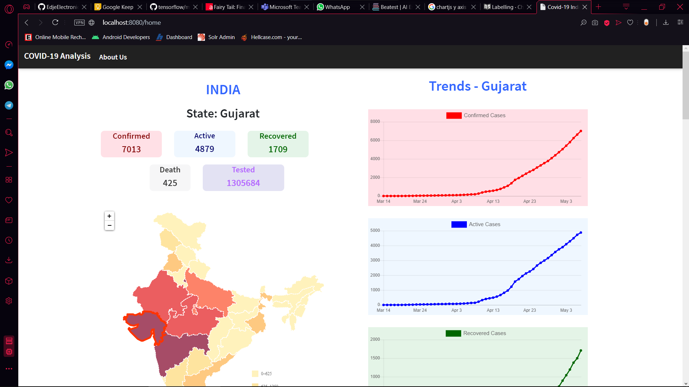
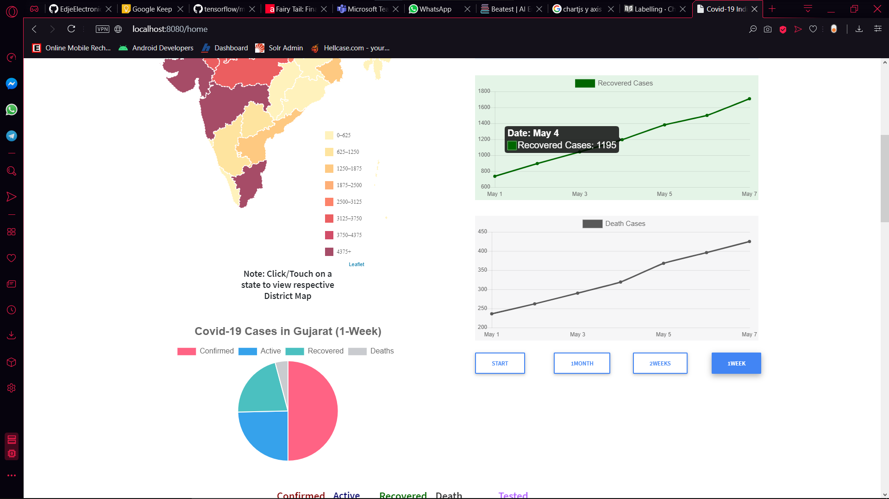
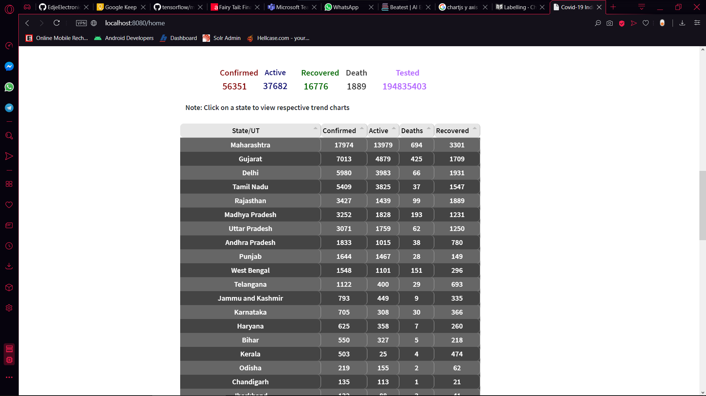
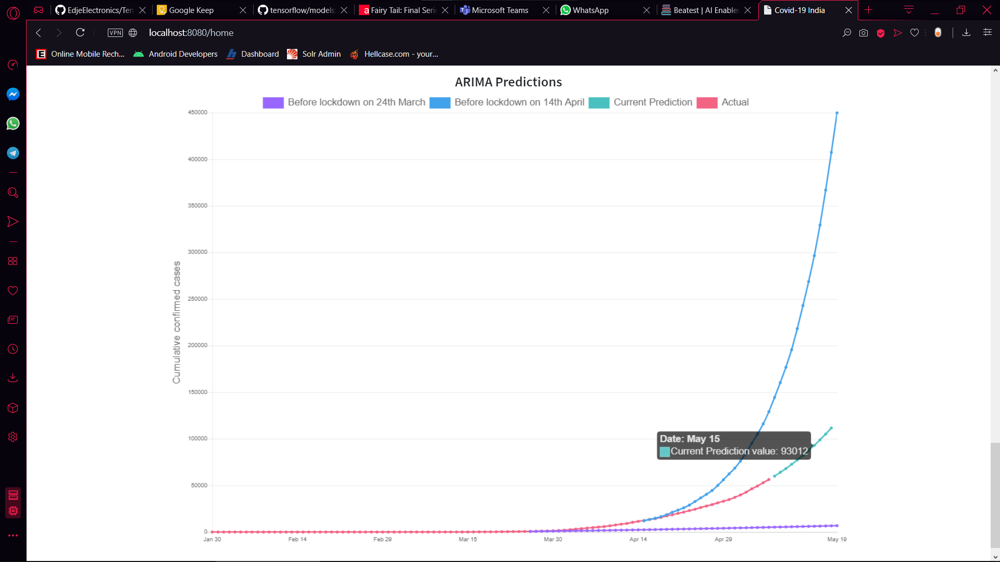
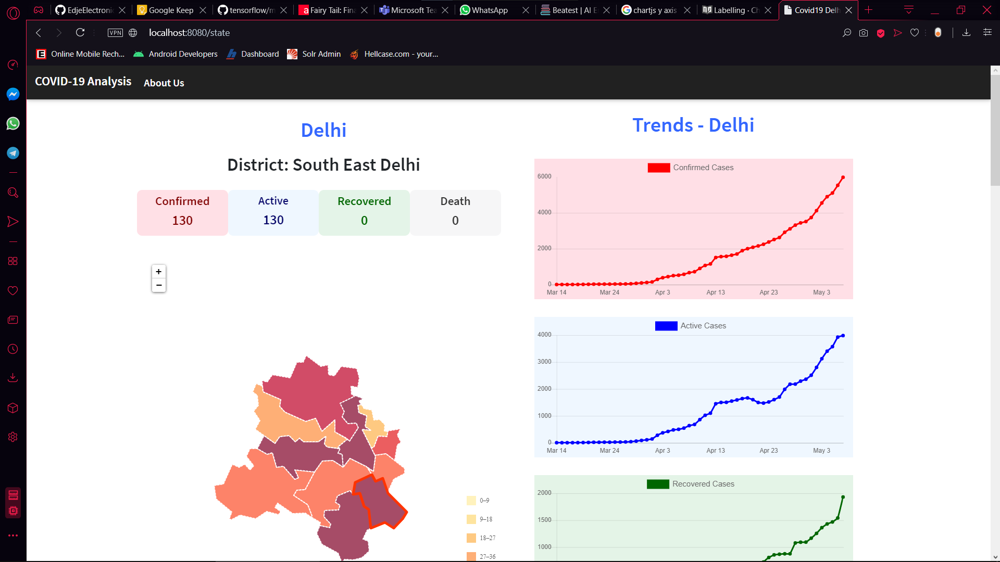
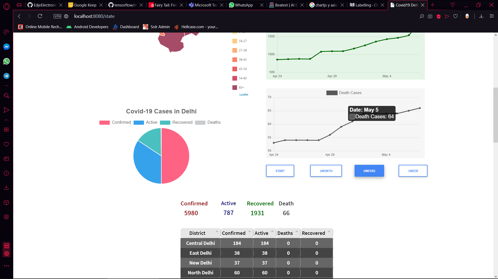
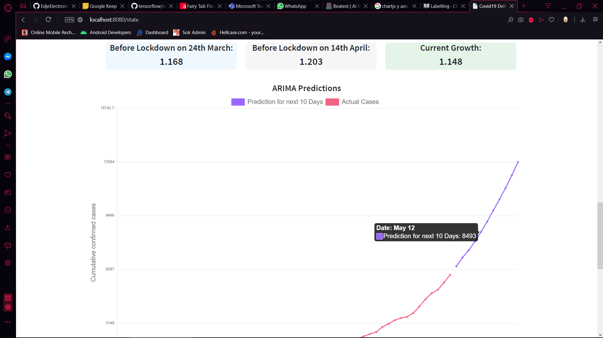
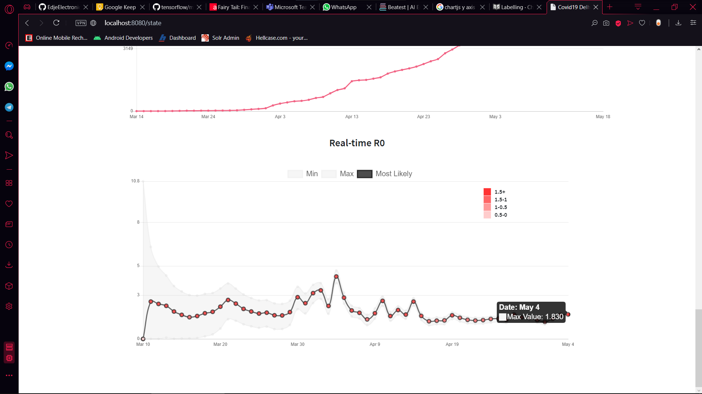

# India Covid19 Analysis

## Contributors

### [Akash Menon](https://github.com/menon99)
### [Sai Aditya Thummala](https://github.com/tsaiaditya) 

## A Java servlet based web application built to keep a track of the covid19 pandemic in India

## *Website* hosted on heroku [IndiaCovid19](https://covid19-india-analysis.herokuapp.com/home)

## The data has been fetched from [api.covid19india.org](https://api.covid19india.org/) . Thank You!

## Django REST API has been used to fetch the results of ARIMA predictions, Growth rate and realtime R0 values [covid19-api-django](https://github.com/menon99/covid-django-api)

## Dependencies

### Backend

- Tomcat 8
- JSP-API
- Javax-Servlet-API
- JSTL
- org.json
- okhttp3
- commons-io

### Frontend

- Tabulator.js
- Leaflet.js
- Bootstrap 4
- Chart.js


## To run locally 
- Install Java version 8 or later
- Install maven on your system
- Clone or download the repo and cd into it
- On Linux/Mac
  ```
  $ mvn package
  $ sh target/bin/webapp
  ```
- On Windows
  ```
  C:/> mvn package
  C:/> target/bin/webapp.bat
  ```

## Screenshots

### Map and trend charts


### Pie chart and timeline buttons


### State-wise table


### Arima chart


#### Note : We have made an effort at trying to predict the confirmed cases over the next ten days. But we aren't specialists in epidemiology so there are bound to be differences between what is actual and what is predicted.

#### These predictions are only meant to be taken as a worst case scenario and with a lot of caution. The assumptions made do not take into consideration public health interventions or any other parameters as such. 

### State Trends




### State Growth rate and Arima chart


### Realtime-R0 graph


## FAQ's on R0

### What is R0?

#### In any epidemic,  𝑅𝑡  is the measure known as the effective reproduction number. It's the number of people who become infected per infectious person at time 𝑡 . The most well-known version of this number is the basic reproduction number: 𝑅0, when  𝑡=0 . However,  𝑅0  is a single measure that does not adapt with changes in behavior and restrictions.


### What can i infer from it?

#### As a pandemic evolves, increasing restrictions (or potential releasing of restrictions) changes  𝑅𝑡 . Knowing the current  𝑅𝑡  is essential. When  𝑅≫1 , the pandemic will spread through a large part of the population. If  𝑅𝑡<1 , the pandemic will slow quickly before it has a chance to infect many people. The lower the  𝑅𝑡 : the more manageable the situation. In general, any  𝑅𝑡<1  means things are under control.

### Why isn't R0 being calculated on a National level?

#### It is not useful to understand  𝑅𝑡  at a national level. Instead, to manage this crisis effectively, we need a local (state, county and/or city) granularity of  𝑅𝑡 . 

### What does Max, Min and Most likely mean in the R0 graph?

#### Max and Min indicate the range of values R0 could have been on that particular day. This range is huge at the beginning of an epidemic as we do not have much data about it. But as we gather more data, we can see that the area between the Max and Min lines start becoming narrow and begin to coincide with Most Likely R0 plot.

### What is the methodology being used to calculate R0?

#### It's a modified version of a solution created by Bettencourt & Ribeiro in 2008 to estimate real-time  𝑅𝑡  using a Bayesian approach. We have used this model to estimate a time-varying  𝑅𝑡 . 

